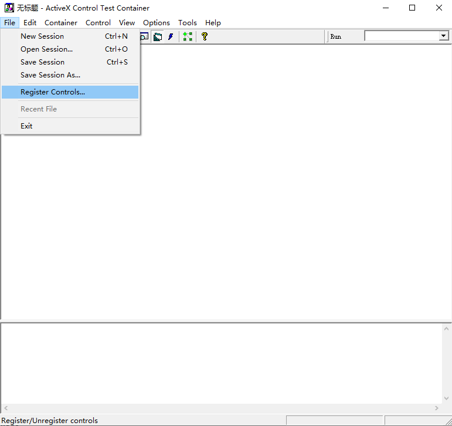
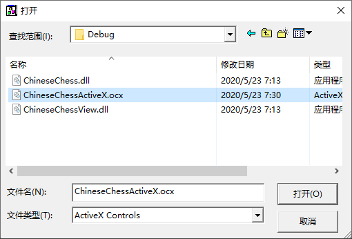
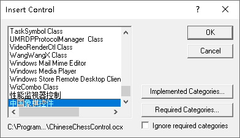

## 开发者文档
作者：康林 (kl222@126.com)

--------------------------

### 编译
- 用 cmake , 建议使用此方法编译

      git clone https://github.com/KangLin/ChineseChessControl.git
      mkdir build
      cd build
      cmake ..
      cmake --build .

- 遗留的编译方法，不再受支持。
  - 用VC6.0打开 Src/ChineseChessControl.dsw,直接编译。不再支持此方法编译
  - 用 VC2017 打开 Src/ChineseChessControl.sln ,直接编译。不再支持此方法编译

### 调试
#### VC6.0
- 打开 ActiveX control test container 工具  

- 注册中国象棋控件  
  这一步在编译或安装时，会自动完成。如果没有成功，可以按下面方法之一注册：  
  **注意**:需要管理员权限
  + 手工注册

        regsvr32 /s /c "D:\Source\ChineseChessControl\Src\.\DebugU\ChineseChessControl.ocx" 

  + 用 ActiveX control test container 注册
    - 打开注册控件  

    - 注册中国象棋控件  
      + 
      + 
      + 
- 插入中国象棋控件  

- 调试  

#### VS 2017

- 从 VS 2010 没有自带 ActivX control test container 工具，而是以例子程序的方式提供。所以你可以从 vc6.0 中复制过来，或者，从 VS 2017 安装的例子程序中编译得到。

[Testing Properties and Events with Test Container](https://docs.microsoft.com/en-us/cpp/mfc/testing-properties-and-events-with-test-container)

如果没安装，则可从 github 上下载[源码](https://github.com/microsoft/VCSamples/tree/master/VC2010Samples/MFC/ole/TstCon)

- 工具->外部工具->添加
  + 
  + 
- 剩下的调试步骤与上面VC6.0的一样

### 使用
- [如何：向 Windows 窗体添加 ActiveX 控件](https://docs.microsoft.com/zh-cn/dotnet/framework/winforms/controls/how-to-add-activex-controls-to-windows-forms)

### 控件
#### 属性:
- Enabled: 允许或禁止控件
- QiPangColor: 棋盘颜色
- TiShiBoxColor: 提示框的颜色
- QiPangPicture: 棋盘图片
- QiPangLayout: 棋盘布局。取下列值：
  + NoQi：无棋子
  + OnlyTopRed = 1：只有上面红棋子
  + OnlyBottomBlack = 2：只有下面红棋子
  + SwapRedBetweenBlack = 4：交换棋子
  + OnlyTopBlack = OnlyTopRed | SwapRedBetweenBlack：只有上面黑棋子
  + OnlyBottomRed = OnlyBottomBlack | SwapRedBetweenBlack：只有下面红棋子
  + TopRedAndBottomBlack = OnlyTopRed |      OnlyBottomBlack：上红下黑
  + TopBlackAndBottomRed = OnlyTopBlack | OnlyBottomRed | SwapRedBetweenBlack：上黑下红

注意：如果布局不完全，则由用户控制属性（Enabled）以决定是否下棋。

- StartSide: 开始走棋时的状态。这个要在 ReStart 前设置。取下列值：
  + RedReadly：红棋准备走
  + RedWalked：红棋正在走
  + BlackReadly：黑棋准备走
  + BlackWalked：黑棋正在走

- CurrentSide：走棋时的状态。取上面的值。

#### 方法:
- NextStep(): 下一步
- PreviouStep(): 上一步
- ReStart(): 重新开始
- SaveChess(BSTR lpcszFileName): 保存棋局
- LoadChess(BSTR lpcszFileName): 装载棋局并设置为结束状态
- LoadChessStart(BSTR lpcszFileName): 装载棋局并设置为开始状态
- QiPangInterconvert():

#### 事件:
- MoveChess(short x, short y, ENUM_QiZi chess):走棋。此事件在属性 CurrentSide 改变前发生。

